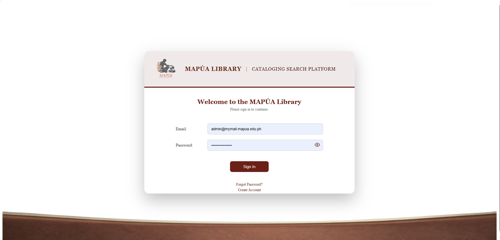
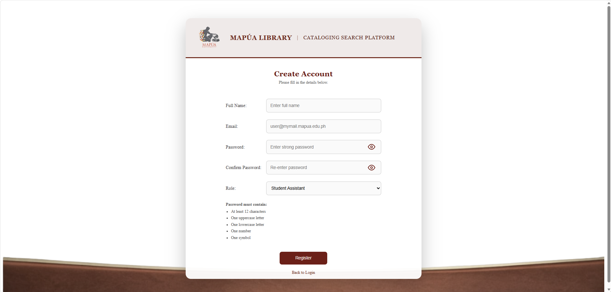
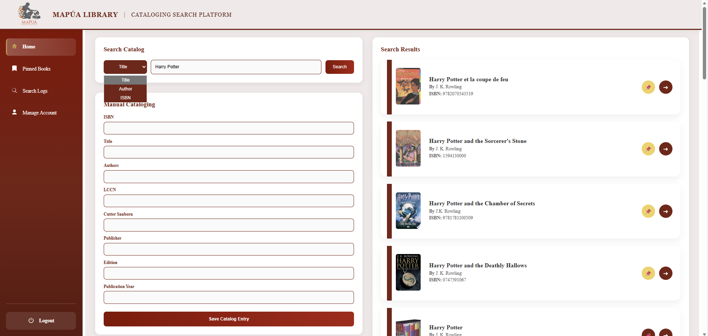
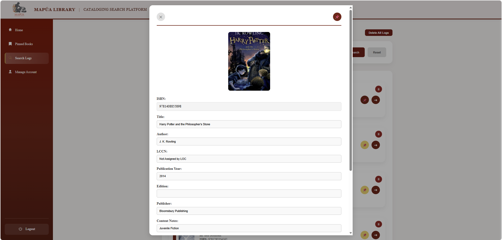
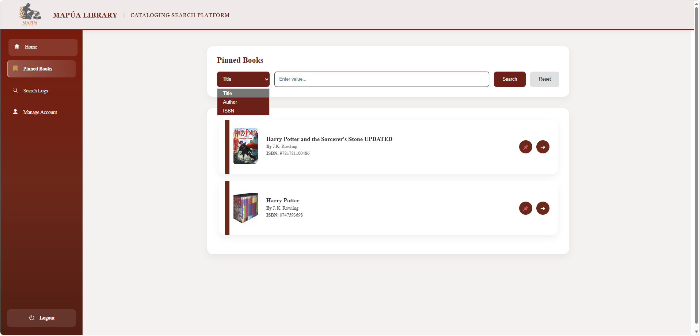
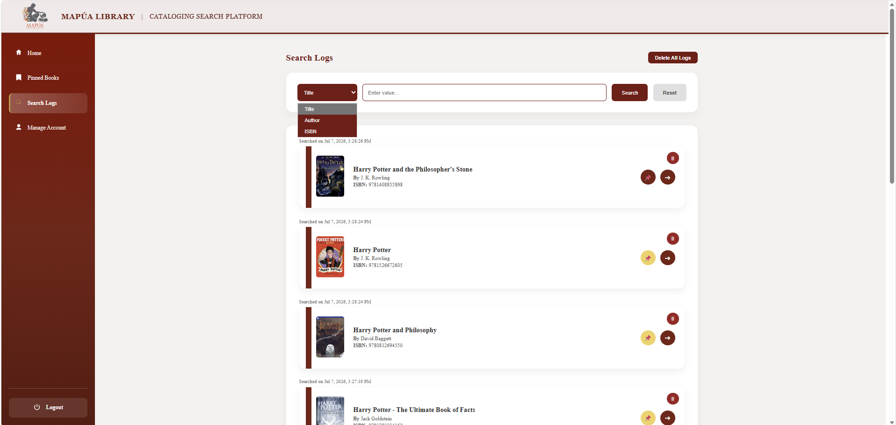
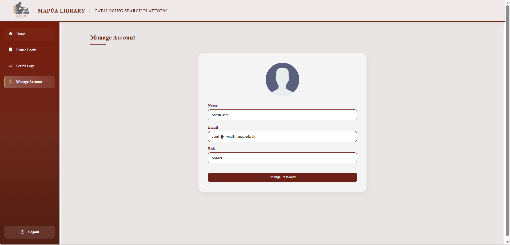

# Cataloging Search Resources Platform  
### Mapúa University Library – Makati Campus  

---

## Project Overview


The **Cataloging Search Resources Platform** is a desktop-based web application developed for the **Mapúa University Library – Makati Campus** to improve the efficiency of bibliographic searching and cataloging operations.

The platform enables librarians and authorized staff to search for book information using **ISBN, title, or author** by aggregating metadata from multiple trusted bibliographic sources. Rather than searching each repository individually, the system consolidates results into a single interface, reducing manual effort and improving cataloging accuracy.

To support library workflows, the application provides features such as user authentication, role-based access control, pinned records, account management, search history, and audit logging. It also generates Cutter Numbers to assist in organizing library collections according to standard cataloging practices.

Originally designed to integrate with Library of Congress, WorldCat, Amazon Books, and Goodreads, the system was adapted to use publicly accessible APIs due to licensing and subscription restrictions. The final implementation integrates the **Library of Congress API**, **Open Library API**, and **Google Books API**, providing comprehensive bibliographic information while remaining compliant with publicly available services.

This project was developed as an undergraduate thesis and was designed in consultation with the **Head Cataloger of the Mapúa University Library – Makati Campus** to ensure that its features align with real-world cataloging workflows and library requirements.

---

# Screenshots of Webpages

## Login Page



Users authenticate using their authorized Mapúa library account.

---

## Register Account Page



Administrators can register new librarian or student assistant accounts.

---

## Home Search Page



The main interface where librarians can search books using ISBN, title, or author.

---

## Book Details & Edit Page



Displays complete bibliographic information and allows authorized users to edit pinned records.

---

## Pinned Books Page



Shows bookmarked catalog records for quick access and future modifications.

---

## Search Logs Page



Displays users' search history for monitoring and auditing purposes.

---


## Manage Account Page



Administrators can manage existing user accounts and their roles.
---

## Original System Requirement

The original system requirement included integration with:

- Library of Congress – book information  
- WorldCat – book information  
- Amazon Books – book summaries  
- Goodreads – book summaries  
- Cutter Number System – author classification  

However, during development, it was identified that:

- WorldCat  
- Amazon Books  
- Goodreads  

require paid subscriptions and restricted API access.

---

## Implemented Data Sources

To ensure full functionality using legally accessible APIs, the following were implemented:

- **Library of Congress API** – Primary authoritative source  
- **Open Library API** – Substitute for WorldCat  
- **Google Books API** – Substitute for Goodreads  
- **Cutter Number generation logic** (based on standard references)  

Reference: http://cutternumber.com/

Despite the adjustments, the system maintains its objective of aggregating bibliographic metadata from multiple reliable repositories.

---

## System Purpose

- Centralize bibliographic search  
- Reduce manual cataloging effort  
- Aggregate metadata from multiple repositories  
- Support efficient librarian catalog classification  

---

## Key Features

- Partial match searching  
- Aggregated API results  
- Pinning and editing of records  
- Role-Based Access Control (Admin, Student Assistant)  
- Mapúa email-based authentication  
- Audit logging  

System requirements and design were validated through consultation with the Head Cataloger (January 2026).

---

# Technology Stack

## Frontend
- Angular (Desktop-only interface)  
- HTML5  
- CSS3  
- TypeScript  

## Backend
- Spring Boot (Java)  
- RESTful API Architecture  
- Spring Data JPA  
- Hibernate ORM  
- Maven  

## Database
- MySQL  
- MySQL Workbench  

Stores:
- User accounts  
- Roles  
- Pinned records  
- Search logs  
- Audit logs  

---

# Authentication & Authorization

- Spring Security  
- Role-Based Access Control (RBAC)  
- Mapúa email-based authentication  

### User Roles
- ADMIN  
- STUDENT_ASSISTANT  

---

# External APIs Integrated

- Library of Congress API  
- Open Library API  
- Google Books API  
- Cutter Number logic  

---

# System Architecture

- Client–Server Architecture  
- Layered Backend Architecture:
  - Controller Layer  
  - Service Layer  
  - Repository Layer  
  - Entity Layer  
- REST-based communication between Angular and Spring Boot  

Future integration support:
- Borrowing/Circulation Systems  
- Student Database Systems  
- RFID/Barcode Infrastructure  

---

# Setup and Installation

## Clone Repository

```bash
git clone https://github.com/NatalieVeluz/Cataloging-Search.git
```

Or download as ZIP.

---

## Database Setup (MySQL)

```sql
CREATE DATABASE catalog_db;
USE catalog_db;
```

Import tables from the `Database` folder using MySQL Workbench.

---

## Backend Setup (Spring Boot)

Open **Backend** folder in IntelliJ.

Update:

```
src/main/resources/application.yml
```

```yaml
spring:
  datasource:
    username: your_mysql_username
    password: your_mysql_password
```

Run:

```bash
mvn clean install
mvn spring-boot:run
```

Backend runs at:

```
http://localhost:8080
```

---

## Frontend Setup (Angular)

Open **Frontend** folder in VS Code.

```bash
npm install
ng serve
```

Frontend runs at:

```
http://localhost:4200
```

---

# Current Authentication Setup

For testing purposes, authentication is handled through database-stored accounts.

### Default Test Accounts

**Admin**
```
Email: admin@mymail.mapua.edu.ph
Password: admin123
Role: ADMIN
```

**Student Assistant**
```
Email: assistant@mymail.mapua.edu.ph
Password: assistant123
Role: STUDENT_ASSISTANT
```

⚠️ Passwords are stored in plain text for development only.

---

# User Manual

## Login
Open:
```
http://localhost:4200
```

Enter valid credentials.

---

## Search Books
Search using:
- ISBN  
- Title  
- Author  

Results are aggregated from:
- Library of Congress  
- Open Library  
- Google Books  

---

## Pin Books
Click **Pin** from search results.  
Pinned books appear in the **Pinned Books** section.

---

## Edit Records
Authorized roles may edit pinned records.  
Changes are logged in audit logs.

---

## Search Logs
Authorized users may:
- View logs  
- Delete individual logs  
- Delete all logs  

---

# Future Enhancements

- Official Mapúa SSO Integration  
- Subscription-based API integration (WorldCat, Amazon, Goodreads)  
- Borrowing & Circulation module  
- RFID / Barcode integration  
- MARC export  
- Analytics dashboard  
- Cloud deployment  

---

# System Limitations

- No official Mapúa authentication integration  
- Subscription APIs not implemented  
- No borrowing system  
- Desktop-only interface  
- Local deployment only  

---

# Version

v1.0 – Thesis Implementation Complete  
February 2026
